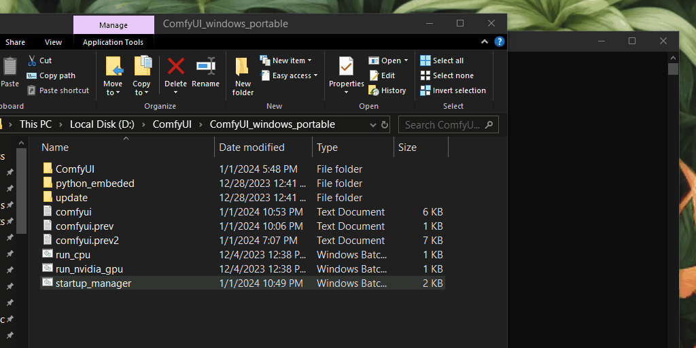

# ComfyUI Startup Manager
An optional bat file that manages `custom_nodes` for ComfyUI Windows users.🤖

## Demo⚡️
Here's a simple demo on how to use this tool:

## Installation
1. Copy `startup_manager.bat` to your local path e.g. `D:\ComfyUI\ComfyUI_windows_portable`.
1. Run `startup_manager.bat`, That's it. Have fun!

## Acknowledgements
1. [Comfyanonymous](https://github.com/comfyanonymous) for providing an amazing tool that is ComfyUI! Thank you!🙇‍♀️
2. CompVis, [StableDiffusion team](https://huggingface.co/CompVis) for continuing to maintain StableDiffuion models and having it opensourced.
3. Hugging Face [Optimum](https://github.com/huggingface/optimum) team for making the BetterTransformer API so easily accessible.